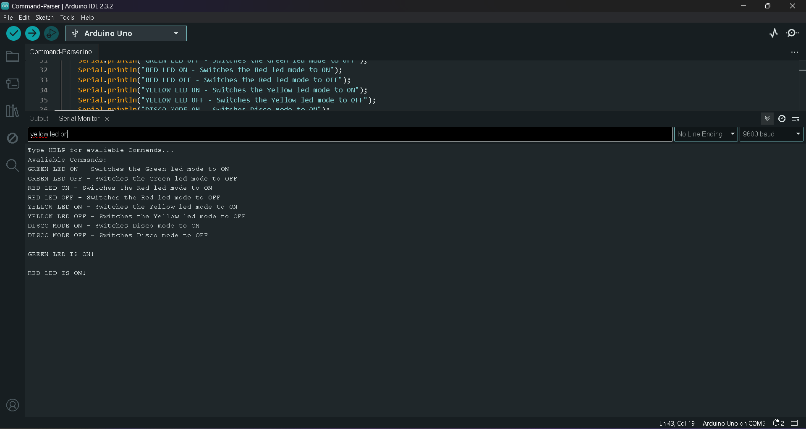

# Simple-Arduino-Command-Parser
Using 3 leds(green, red, yellow) as an example.
```
#define GREEN_LED_PIN 9
#define RED_LED_PIN 10
#define YELLOW_LED_PIN 11

pinMode(GREEN_LED_PIN, OUTPUT); 
pinMode(RED_LED_PIN, OUTPUT);
pinMode(YELLOW_LED_PIN, OUTPUT);

```
The parser begins with opening the serial communication and setting the baudrate.
```
 Serial.begin(9600);
```

And then comes the actual parser...<br>
First it checks if there is more than 0 bytes in the buffer "Serial.available() > 0"...<br>
And if it does, it reads the buffer until it hits a newline charachter "\n" and store it in a string "input"...<br>
Then we use if/else if statements to catch diffrent input values, in this case "GREEN LED ON" etc...
```
if (Serial.available() > 0) {

        String input = Serial.readStringUntil('\n'); 

        if(input == "HELP" || input == "help"){

            commandHelp();

        }else if(input == "GREEN LED ON" || input == "green led on"){

            turnOnLed(GREEN);

        }else if(input == "GREEN LED OFF" || input == "green led off"){

            turnOffLed(GREEN);

        }else if(input == "RED LED ON" || input == "red led on"){

            turnOnLed(RED);

        }else if(input == "RED LED OFF" || input == "red led off"){

            turnOffLed(RED);

        }else if(input == "YELLOW LED ON" || input == "yellow led on"){

            turnOnLed(YELLOW);

        }else if(input == "YELLOW LED OFF" || input == "yellow led off"){
            
            turnOffLed(YELLOW);

        }else if(input == "DISCO MODE ON" || input == "disco mode on"){
            greenLedState = OFF;
            redLedState = OFF;
            yellowLedState = OFF;
            discoState = ON;
            Serial.println("DISCO MODE ON!\n");

        }else if(input == "DISCO MODE OFF" || input == "disco mode off"){

            discoState = OFF;
            Serial.println("DISCO MODE OFF!\n");

        }else {

            Serial.println("Invalid input!\n");

        }
```

## Demo





